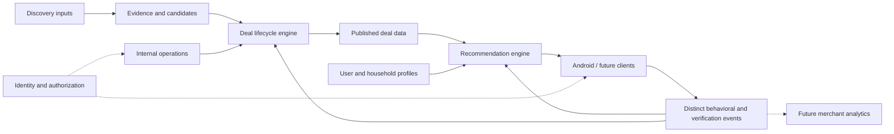

# Architecture

Version 0.2 · Working design · September 26, 2026

## Guiding principle

**Design the seams now, not all the features now.** Engine first, UI second. These are logical responsibilities, not a mandate for eight deployed services, microservices or separate databases.

| System | Responsibility | Initial direction |
|---|---|---|
| Consumer app | Profile input, recommendation and deal presentation, eventual feedback capture | Android/Kotlin/Jetpack Compose; future clients use the same platform. |
| Recommendation engine | Geographic candidate selection, applicability/time/eligibility filtering, ranking and explanations | Basic personalized rules first; scoring formula TBD. |
| Data platform | Restaurant/deal, consumer and event domains, relationships and history | Logical design first; storage technology not finalized. |
| Deal lifecycle engine | Moves evidence/candidates through review, publication, monitoring and retirement | Manual/simple transitions initially; automation later. |
| Internal ops/admin tool | Views and controlled interventions across the platform | Manual operations first; dedicated tool Planned. |
| Discovery inputs | Manual research, later users/crawls/search/AI/merchants | Produce evidence/candidates, never bypass validation. |
| Identity/user management | Authentication, identity linkage, roles, permissions and account operations | Separate seam now; consumer sign-in requirements TBD. |
| Merchant platform | Claims, offer management, targeting and lead analytics | Future. |

## Logical flow

All persistent domains belong to the data platform; the diagram separates responsibilities, not physical stores. Verification updates inform the lifecycle, not direct unreviewed consumer publication.

## Data domains and ownership

| Domain | Logical responsibility | Owner assignment |
|---|---|---|
| Restaurants and locations | Master identity, external references, geography and corrections | Named human/team TBD; maintained through operations. |
| Deals, applicability and evidence | Terms, provenance, validation and publication history | Lifecycle/operations responsibility; named owner TBD. |
| Identity and access | Authentication and permission enforcement | Identity area; provider and owner TBD. |
| Users, households and preferences | Explicit profile and derived learning, kept distinguishable | Consumer domain; owner TBD. |
| Behavioral events | Traceable observations with actual meaning and provenance | Event domain; owner and retention policy TBD. |
| Recommendations | Selection/ranking explanations and outcomes | Recommendation engine; owner TBD. |

User data need not reside in a separate physical “user database.” Physical boundaries depend on access, security and operational needs.

## Recommendation boundary

Begin with approximate user position and radius; identify nearby locations; find deals for represented restaurants; resolve scope and DealLocation applicability; evaluate date/time and eligibility; apply preferences; rank and return a small set. Do not fetch the national dataset for a dinner query.

The master model supports expansion beyond an initial market. Only supported markets need be populated initially. Elk Grove/Sacramento is the discussed sandbox area, not a nationwide launch commitment. Geographic caches may be useful later, but are not required now.

Preserve a platform-agnostic boundary around data, ranking and learning. Shared backend services are the direction; exact hosting and client/server execution split must be reviewed against existing prototype code.

## Identity and internal operations

Authentication answers who is acting; profile describes what is known about them; activity records what happened. Anonymous versus authenticated MVP use is open. Google sign-in was a later possibility, not a selected launch requirement. Anonymous-to-account migration needs design if anonymous use is selected.

The internal tool should provide coherent views of the same platform: candidate/deal queues and evidence, pending approval/published/retired states, restaurant/location maintenance, user and feedback management, roles/permissions, and future merchant management. Actions envisioned include approve, reject, merge and retire, with human versus automated decisions distinguishable.

Consumer, administrator/operator and merchant are conceptual roles. Exact role matrix is TBD. A full portal is not required immediately; authorized manual operations can support the early workflow. Operational permission enforcement is required when those actions become available, independent of whether consumers have sign-in.

## Environment and test-data strategy

Keep dev, QA/staging and prod code configuration and data isolated. The current request explicitly calls for all three; provisioning details and timing are TBD. Development experiments and QA stress tests must not touch production users or deals. Promote reviewed code/configuration through testing, not synthetic datasets into prod.

Use real restaurant/location records at useful scale, synthetic deals marked TEST_DATA for edge cases, and a smaller source-verified genuine deal set for end-to-end testing. Both labeling and environment separation are necessary safeguards. No continuously synchronized/live provider feed is required for the sandbox.

Earlier suggestions included 100–300 locations and 500–2,000 synthetic deals. Genuine deal suggestions varied from 10–20 to 20–50. These are planning examples; exact targets remain open.

## Physical design gate

Firestore/Firebase is a candidate, not a final architecture decision. Before implementation: validate logical scenarios → define access patterns and expected volumes → compare storage/backend options → review physical layout, authorization, indexes and denormalization → implement and test.

Review external restaurant data providers, allowed storage/caching, request budgets and current terms before ingestion. Google Places was considered; “one small call” is a user aspiration, not a verified ingestion plan. No provider costs or quotas are established by these documents.

Open technical choices include API contracts, geographic indexing, time-zone semantics, event delivery/idempotency, audit/version storage, deployment tooling, retention/deletion and recovery. See [DECISIONS](DECISIONS.md).

## Technology learning notes

Kotlin is the initial Android programming language; Compose builds its UI; Android Studio builds/runs/debugs the client. Git records changes and GitHub can host the repository. A backend serves shared data and business logic; a database persists it; an API defines how components communicate. VS Code is optional for editing notes/code and Figma is optional for design. The discussion reports a working prototype, but this pack has not inspected it. Record rationale, alternatives and owner learning needs as new technologies are selected.
