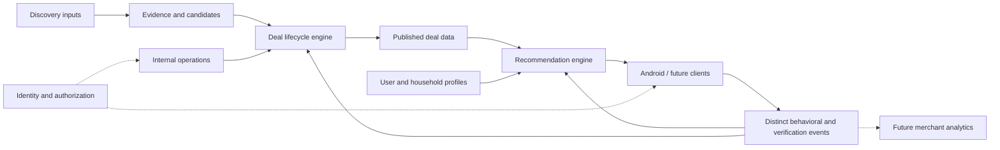

# Architecture

Version 0.2 · Working design · September 26, 2026

## Guiding principle

**Design the seams now, not all the features now.** Engine first, UI second. These are logical responsibilities, not a mandate for eight deployed services, microservices or separate databases.

| System | Responsibility | Initial direction |
|---|---|---|
| Consumer app | Profile input, recommendation and deal presentation, eventual feedback capture | Android/Kotlin/Jetpack Compose; future clients use the same platform. |
| Recommendation engine | Geographic candidate selection, applicability/time/eligibility filtering, ranking and internal score traceability | Basic personalized rules first; version 1 local scoring is implemented. |
| Data platform | Restaurant/deal, consumer and event domains, relationships and history | Room/SQLite for local MVP persistence behind repositories; shared backend remains open. |
| Deal lifecycle engine | Moves evidence/candidates through review, publication, monitoring and retirement | Manual/simple transitions initially; automation later. |
| Internal ops/admin tool | Views and controlled interventions across the platform | Manual operations first; dedicated tool Planned. |
| Discovery inputs | Manual research, later users/crawls/search/AI/merchants | Produce evidence/candidates, never bypass validation. |
| Identity/user management | Authentication, identity linkage, roles, permissions and account operations | Separate seam now; consumer sign-in requirements TBD. |
| Merchant platform | Claims, offer management, targeting and lead analytics | Future. |

## Logical flow

All persistent domains belong to the data platform; the diagram separates responsibilities, not physical stores. Verification updates inform the lifecycle, not direct unreviewed consumer publication.

## Data domains and ownership

| Domain | Logical responsibility | Owner assignment |
|---|---|---|
| Restaurants and locations | Master identity, external references, geography and corrections | Named human/team TBD; maintained through operations. |
| Deals, applicability and evidence | Terms, provenance, validation and publication history | Lifecycle/operations responsibility; named owner TBD. |
| Identity and access | Authentication and permission enforcement | Identity area; provider and owner TBD. |
| Users, households and preferences | Explicit profile and derived learning, kept distinguishable | Consumer domain; owner TBD. |
| Behavioral events | Traceable observations with actual meaning and provenance | Event domain; owner and retention policy TBD. |
| Recommendations | Selection/ranking explanations and outcomes | Recommendation engine; owner TBD. |

User data need not reside in a separate physical “user database.” Physical boundaries depend on access, security and operational needs.

## Recommendation boundary

Begin with approximate user position and radius; identify nearby locations; find deals for represented restaurants; resolve scope and DealLocation applicability; evaluate date/time and eligibility; apply preferences; rank and return a small set. Do not fetch the national dataset for a dinner query.

The master model supports expansion beyond an initial market. Only supported markets need be populated initially. Elk Grove/Sacramento is the discussed sandbox area, not a nationwide launch commitment. Geographic caches may be useful later, but are not required now.

Preserve a platform-agnostic boundary around data, ranking and learning. Shared backend services are the direction; exact hosting and client/server execution split must be reviewed against existing prototype code.

## Identity and internal operations

Authentication answers who is acting; profile describes what is known about them; activity records what happened. Guests may use recommendations, plan intent and check-ins. Sign-in is required for deal submissions and problem reports, with menu and submission entry points. Guest-to-account migration must preserve profile/history. Provider, recovery and cross-device synchronization remain open. Shared submissions/publication require a backend and enforced permissions; local Room alone cannot distribute deals to other users.

The internal tool should provide coherent views of the same platform: candidate/deal queues and evidence, pending approval/published/retired states, restaurant/location maintenance, user and feedback management, roles/permissions, and future merchant management. Actions envisioned include approve, reject, merge and retire, with human versus automated decisions distinguishable.

Consumer, administrator/operator and merchant are conceptual roles. Exact role matrix is TBD. A full portal is not required immediately; authorized manual operations can support the early workflow. Operational permission enforcement is required when those actions become available, independent of whether consumers have sign-in.

## Environment and test-data strategy

Keep dev, QA/staging and prod code configuration and data isolated. The current request explicitly calls for all three; provisioning details and timing are TBD. Development experiments and QA stress tests must not touch production users or deals. Promote reviewed code/configuration through testing, not synthetic datasets into prod.

Use real restaurant/location records at useful scale, synthetic deals marked TEST_DATA for edge cases, and a smaller source-verified genuine deal set for end-to-end testing. Both labeling and environment separation are necessary safeguards. No continuously synchronized/live provider feed is required for the sandbox.

Earlier suggestions included 100–300 locations and 500–2,000 synthetic deals. Genuine deal suggestions varied from 10–20 to 20–50. These are planning examples; exact targets remain open.

## Physical design gate

Room over SQLite is accepted for the Android tester-ready MVP's local persistence. Room-specific entities and DAOs stay inside the Android data layer; Compose and domain logic use repository boundaries and ordinary Kotlin models. Export and version Room schemas, use application-owned UUIDs, and manage upgrades with explicit migrations. This choice does not select the future shared backend. Room may later remain as an offline cache or be replaced behind the repositories.

Supabase/PostgreSQL is accepted for a bounded development proof after comparing it with Firebase/Firestore. SQL familiarity, relational integrity and imports are the rationale. This is not authorization to buy a production plan or declare the full hosted backend complete. Production sizing, email delivery, recovery, authorization and user synchronization still require review.

The development proof lives in `backend/proof`: private restaurant/location/deal/version/applicability tables, CSV fixture import, a guest-readable published-only RPC and a reviewer-only publication RPC. The public functions run with a fixed empty search path and narrow grants. All private tables enable RLS and deny direct client access. Reviewer identity is checked against a protected Auth-UUID allowlist; this does not replace the accepted stable app_user/auth_identity model for consumer data.

The browser proof holds development login sessions in memory. The Android debug testing card reads the DEV/test-data RPC using a publishable key configured in ignored local.properties; release values are blank. Synthetic offers never feed Room or recommendations. Local embedded PostgreSQL tests verify SQL/grants, but live JWT, Data API and device connectivity still need the new Supabase development project. Full schedules, structured conditions, effective-dated applicability, evidence, submissions and production isolation are outside this first proof.

Review external restaurant data providers, allowed storage/caching, request budgets and current terms before ingestion. Google Places was considered; “one small call” is a user aspiration, not a verified ingestion plan. No provider costs or quotas are established by these documents.

Open technical choices include API contracts, geographic indexing, time-zone semantics, event delivery/idempotency, audit/version storage, deployment tooling, retention/deletion and recovery. See [DECISIONS](DECISIONS.md).

## Technology learning notes

Kotlin is the initial Android programming language; Compose builds its UI; Android Studio builds/runs/debugs the client. Git records changes and GitHub can host the repository. A backend serves shared data and business logic; a database persists it; an API defines how components communicate. VS Code is optional for editing notes/code and Figma is optional for design. The discussion reports a working prototype, but this pack has not inspected it. Record rationale, alternatives and owner learning needs as new technologies are selected.

## Current Android source boundaries

The prototype now uses a small package structure without changing its runtime behavior:

| Area | Current responsibility |
|---|---|
| `MainActivity.kt` | App entry point, screen coordination and current top-level prototype state. |
| `ui/screens` | Onboarding, Home, recommendations/details, Food Profile, Profile/removed places and shared Compose components. |
| `model` | Plain Kotlin records such as `PlaceDeal`, `QuizPlace` and `MealRecord`. |
| `data` | Room-backed household, restaurant-preference and dinner-journey repositories plus exported, versioned schemas. |
| `domain` | Plain Kotlin deal-eligibility and recommendation-scoring rules that do not depend on Compose or Android UI. |
| `PrototypeData.kt` | Curated prototype places/deals and current Food Profile selection helpers. |
| `ui/theme` | Compose colors, typography and theme. |

This is an intermediate modularization. Household profiles, guest identity, restaurant ratings, exclusions, the prototype catalog, recommendation selections, meal occasions, plan intents, check-ins and outcomes now persist through repository interfaces backed by Room. Existing household and preference data import once when their Room records are initialized; inaccurate legacy meal history is not promoted into the normalized chain. Recommendation version 1 remains isolated as plain Kotlin domain logic with unit tests. Small prototype-only UI settings still use preferences.

As of October 2, 2026, schema 5 adds catalog display/scoring metadata, restaurant trait rows and weekday schedule rows tied to deal versions. `RoomCatalogRepository` provides the snapshot used by recommendations, the food quiz, removed places and Home. The Kotlin prototype lists initialize an empty catalog; they are no longer runtime inputs to those screens or rewritten over saved published offers at each launch. Existing schema 4 records are retained while the missing metadata and schedules are populated once. The snapshot reloads on app launch or tester reset; live synchronization and catalog administration remain future work.

These are deliberately limited prototype tables. Metadata is currently per seeded restaurant and the catalog has one seeded location/offer per place. Full location applicability, structured eligibility, version-specific provenance and multiple offers/locations still require the accepted relational design before a broader catalog is loaded. This change does not verify the sample deals or complete production ingestion.

Verification: debug build and 17 unit tests passed. All three emulator tests passed, including catalog seed round-trip, database-authoritative values, preservation of published wording, newer published versions and catalog reset. A separate schema 4-to-5 fixture successfully migrated and retained its existing restaurant record. The owner authorized emulator app-data reset for these tests; the app was reinstalled afterward. This verifies the tested migration fixture, not every historical profile or production migration scenario.

Debuggable Android builds also expose a separated `Prototype tools` screen. Its simulated day is stored only in local prototype preferences and feeds the same recommendation and offer-timing paths as the actual calendar day. A visible banner prevents simulated results from being mistaken for actual-day behavior. Release builds do not show the menu destination.

## Development shared catalog connection — October 3, 2026

The configured debug app fetches `ww_app_catalog` on opening and eligible foreground returns, validates the complete snapshot, and updates Room in one transaction. The current endpoint supplies three restaurant locations and deliberately no offers: TEST ONLY fixtures remain confined to the proof tool. These restaurants can be recommended without a deal. Release configuration remains disconnected pending production setup.

Schema 6 adds shared-to-local identity mapping, refresh state and a replaceable current offer/location projection. Existing personal rows keep their local IDs. Withdrawn catalog rows become inactive; historical offer versions and pending-plan references remain available. Failed refresh keeps personal data and prior plans accessible, pauses new recommendations and exposes Retry. The snapshot stays stable while selecting dinner.

This is a bounded development connection, not the complete production deal model. Real offer publication, structured date/time and eligibility, distance, full multiple-location selection and a scalable paginated refresh contract remain work ahead. Outcome correction and Undo remain pending.

## Anonymous tester intake — October 4, 2026

For the private development feature test, anonymous Supabase-authenticated users may submit deals without email/password. This explicitly overrides the identifiable-sign-in submission requirement for testing only; public launch policy and problem-report access are not changed. Recommendations still require no account screen. The anonymous identity is created when Share a deal opens and is linked to the existing local app user. Reopening reuses the encrypted session; tokens refresh when needed. Clearing/resetting data loses submission access and starts a new identity; recovery and cross-device sync are deferred.

Schema 7 adds the user/auth-project identity association. Tokens are encrypted with Android Keystore and stored outside Android backup. No service-role credentials enter the app. Backend 005 provides authenticated submission and own-only read RPCs, idempotent retry IDs, basic length/location validation and ten submissions per identity per day. New entries remain PENDING and never enter recommendation results. This per-identity cap is not a complete public abuse control. Production CAPTCHA/access limits and public identity policy remain launch gates.

Implemented UI: Share a deal, choose a known location or describe another place, enter free-text offer details, send for review and refresh My submissions. Reviewer UI, clarification/resubmission, publication of real reviewed offers and complete end-to-end hosted verification remain pending. No offline queue is introduced.

## Submission experience — October 4, 2026

Share a deal now has two steps: search/select a location (or describe a missing place), then write one offer description. Search calls a bounded backend prefix query after a short typing pause, returning at most ten active locations with addresses and shared restaurant/location UUIDs. It does not load the whole catalog into the form or depend on the recommendation snapshot. A lowercase-name index supports this initial search; fuzzy/address search, paging, broader geography and catalog enrichment remain later needs. Wildcards and SQL-looking input are treated literally.

The selected place appears in a warm card with Change place. Description and retry ID survive configuration changes; changing the place or description produces a new submission ID before sending. Delivery uncertainty locks the submitted payload for an identical retry. Review fills structured schedule, eligibility and immutable published records; contributor text remains unchanged evidence. Confirmation directs to the separate My submissions page, also available from the menu. The reviewer workflow remains pending.

UI testing compatibility: Espresso 3.7.0 replaces the obsolete reflective InputManager call used by 3.5.1; this is a test-only dependency adjustment required by the current emulator. Reference: https://developer.android.com/jetpack/androidx/releases/test .

## Development reviewer queue — October 4, 2026

The owner approved reviewer editing, missing restaurant/location creation and a test-submission flag. The browser queue at backend/proof/review.html replaces the original permissions-proof screen; that screen remains at publication-proof.html. Status tabs load 20 entries per page. Original contribution text stays unchanged; edits live in review_draft, with optimistic revision checks and append-only application review events. Reviewer-only RPCs enforce access independently of the browser.

Actions are Save draft, Needs clarification, Reject and Approve. Clarification/rejection require a contributor-visible note. Approval resolves or explicitly creates restaurant/location UUIDs, requires offer wording, terms, source, weekdays, deal strength and review confirmation, and creates immutable published version/schedule records atomically. Matching published offer wording/terms/weekdays at a location is rejected as a duplicate. Approval means a possible offer (not verified). The current engine only supports recurring weekly all-day schedules: date-limited or timed offers must be held rather than represented as all-day offers. Structured eligibility expansion remains pending.

After SQL 008, all supported approved development offers and their places reach ww_app_catalog (D-77). No existing submission is automatically approved. Finalized reviews are read-only; published changes require a future new-version workflow. Contributor clarification/resubmission, retirement UI, fuzzy matching and production authentication/abuse controls remain pending.

## Development catalog and launch boundary — D-77 (October 4, 2026)

All approved, supported DEV offers participate in Android recommendations, including previously flagged Panda records. SQL 008 removes per-record test flags without changing published content, IDs, schedules or activity references. Small Development indicators identify the environment. Review approval still means possible deal, not verified deal; permissions, duplicate checks and immutable publication remain. This supersedes earlier test-flag exclusions in D-73/D-76 and sandbox labeling requirements in D-11.

Launch requires a fresh production database: apply reviewed schema, import curated restaurants/locations and genuine reviewed offers, configure the release app, verify environment separation, and begin fresh production activity. Do not copy DEV offers, test accounts or meal history. Preserve DEV for testing. This launch gate is documented, not implemented.
