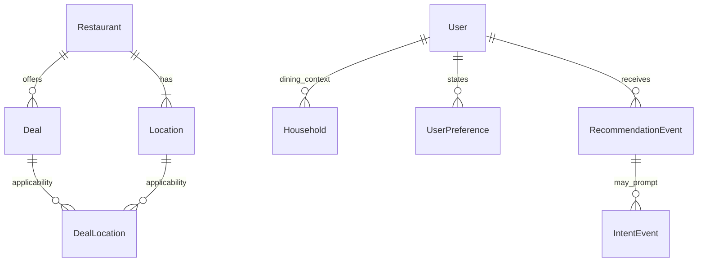

# Logical data model

Version 0.2 · Working design · September 26, 2026

This is a business model, **not a Firestore collection specification**. Entity/field names are working vocabulary. Listed fields are candidates, not a finalized schema, required-field list or API contract. MVP/Planned/Future describe capability scope; they do not require one physical table or document per concept.

## Core relationships

Restaurant 1:N Location is established. User-to-household multiplicity is a working extension-friendly representation: the MVP needs a basic household context, not multi-user household collaboration. Exact membership and ownership cardinalities are TBD. Funnel references beyond intent are deliberately optional: observations may exist without a complete preceding funnel.

The Android prototype's current `HouseholdProfile` stores adult count, one current age entry per child, ZIP code and radius. It does not store child names or birth dates. Exact ages support the current 12-and-under child-deal check; future deals need structured eligibility terms rather than parsing offer text.

## Restaurant and offer domain

| Entity | Scope | Logical identity and candidate fields |
|---|---|---|
| Restaurant | MVP | restaurant_id; name, description, cuisine/category, price level, website, image reference, active status, created/updated times. Business/concept, not a street address. |
| Location | MVP | location_id; restaurant_id; external provider/place references, address, coordinates, phone, active status, timestamps. One physical outlet belongs to one Restaurant in the current model. |
| Deal | MVP | deal_id; restaurant_id; title, description, deal type, value estimate, date range, recurring days/time window, expiration, scope, eligibility, promo code, dine-in/takeout restrictions, lifecycle status and version/history reference. |
| DealLocation | MVP | Logical unique pair deal_id + location_id; applicability, confidence summary, last verification time and supporting evidence references. Optional surrogate ID is a physical-design choice. |

An independent restaurant with one location and a chain with many use the same model. No separate Brand parent is required. A promotion exists once logically even when many outlets participate. DealLocation is a many-to-many applicability relationship; it must not be replaced by duplicated deals or a location-specific boolean.

The current model associates a deal with one restaurant concept. Multi-restaurant campaigns would need a future decision, not an invented relationship now. Location-specific changes to terms may require versions or related offers; representation TBD.

## Scope, applicability and confidence

Working scope vocabulary: UNKNOWN, ALL_LOCATIONS, PARTICIPATING_LOCATIONS, REGION, LOCATION_SET, SINGLE_LOCATION. Exact enum names and regional representation remain open. “National” describes breadth and does not prove every location participates.

Working per-location applicability values: INCLUDED, EXCLUDED, UNKNOWN. Confidence captures strength/freshness of supporting evidence; it is separate from applicability. A known inclusion may become stale. A published deal may have confirmed locations and unknown locations at the same time.

For verified ALL_LOCATIONS scope, exception-based mappings were proposed to avoid enumerating thousands of locations. Whether and how to inherit applicability, prioritize conflicting evidence and represent inclusions/exclusions is unresolved. Absence of a mapping must not silently mean confirmed participation. UNKNOWN is not EXCLUDED, and neither is a verification event.

## Evidence and lifecycle domain

| Concept | Scope | Candidate content and relationships |
|---|---|---|
| DealEvidence / source observation | MVP basic; richer ingestion Planned | evidence_id; source type/reference, observation time, recorded time, submitter/actor if known, raw claim/reference, observed location, supporting material. May precede any canonical Deal. |
| DealCandidate | MVP logical workflow | candidate_id; evidence links, proposed restaurant/location, extracted terms, tentative scope, workflow state. Can be rejected, merged or become a published deal. |
| Validation/transition history | MVP basic record; richer automation Planned | change/event ID, candidate/deal reference, old/new state, actor or process, time, rationale, evidence/version references, human/automated method. |
| DealVerificationEvent | Planned consumer feature; source/admin evidence available initially | verification_id; deal/location references, actor if available, time, availability and honored outcomes, verification method and evidence reference. |

DealSource from earlier sketches is consolidated into the evidence/source-observation concept. Do not require a published deal_id merely to store discovery. Multiple evidence records may support one candidate/deal; candidate merge and shared-evidence linkage details are TBD. Preserve links through promotion and merge rather than discard the original observations.

Evidence and meaningful history are append-only in ordinary operations. Corrections add a new observation or superseding record. Current confidence and status can be derived summaries; they do not replace history. Retention, redaction and deletion requirements must be resolved separately before production—append-only is not an indefinite personal-data retention policy.

## Consumer and identity domain

| Concept | Scope | Candidate content |
|---|---|---|
| User | MVP | Stable user_id, created time, approximate home region, preferred radius, onboarding state, active status. Does not imply mandatory sign-in. |
| Household | MVP basic | household_id, owning user reference, household/party size and children information. Adult/child counts were proposed; exact required fields TBD. |
| UserPreference | MVP basic | user reference, restaurant/category target, preference or exclusion, origin and time. |
| LearnedPreference | Planned | Derived signals with source/provenance, confidence and update time; storage form TBD. Never silently overwrites explicit preference. |
| Identity/account linkage | Separate architectural seam | Application user linked to authentication subject(s) if enabled. Provider, migration and cardinality TBD. |
| Roles/permissions | Planned tool capability; enforcement as needed | Authorized actions and resource scope. Consumer/operator/merchant concepts; exact matrix TBD. |

Eligibility belongs both in offer requirements and relevant user context. Examples include children, military, senior, student, rewards membership, new-customer or birthday conditions. These examples do not mandate collecting every attribute. Exact representation, unknown eligibility behavior and privacy requirements remain open.

## Behavioral event domain

Preserve **Recommendation → Intent → Visit → Deal Confirmation/Verification → Feedback** as distinct observations, not a mutable funnel-status field. Full capture timing is open (Q-06); add events when the corresponding interactions exist, without inferring unobserved outcomes.

| Event | Meaning | Candidate fields beyond its own ID/time |
|---|---|---|
| RecommendationEvent | An option presented to the user | user, restaurant/location, deal/version, context, rank, score/components, explanation. Generated-versus-presented event boundary needs definition. |
| EngagementEvent | Optional detail view or other engagement | recommendation reference, action type, user/context. Planned analytics. |
| IntentEvent | User expresses a choice, e.g. “Let's go” | recommendation reference when known, user, location/deal, action. |
| VisitEvent | Evidence or report of visiting/not visiting | user, location, recommendation/intent reference if known, outcome, confirmation method, optional actual party size. |
| DealVerificationEvent | Deal available/honored outcome | deal, location, user/actor, visit reference if known, method and separate availability/honored answers. |
| FeedbackEvent | Preference or recommendation usefulness | relevant user/recommendation/visit/deal references, feedback target and response, situational versus persistent meaning if supplied. |

Earlier DealFeedback sketches combined deal outcomes and preference feedback. The canonical distinction here keeps their meanings separate even if collected in one interaction. Exact storage boundaries are TBD.

One recommendation can have multiple related observations over time. A visit need not follow tracked intent; a verification can arrive without a tracked visit. Do not require synthetic predecessor events. Cardinalities, deduplication, corrections and attribution windows need physical/event-contract review.

Examples: intent YES then visit NO preserves useful intent; visit YES then deal honored NO records a deal-quality failure. Missing response is unknown, not NO. Household size does not establish actual diner count. Location proximity is not proof of redemption.

## Future merchant domain

Reserve seams for merchant identity, restaurant/location claims, permissions, offer submission and aggregate funnel reporting. Detailed entities, ownership verification and reporting thresholds are TBD. Merchant submissions still enter the evidence lifecycle. No merchant system is required for MVP.

## Access patterns to review before physical design

1. Nearby locations by position/radius and supported market.
2. Published offers for represented restaurants, valid at the requested local date/time.
3. Resolve deal scope, location applicability, eligibility and evidence/confidence.
4. Load user/household and explicit preferences for ranking.
5. Show source/verification context and deal details.
6. Record and correlate actual interactions; query learning history when enabled.
7. List lifecycle queues and evidence; perform authorized audited transitions.
8. Future: aggregate merchant funnel results without inflating intent into visits.

Review query volume, latency, read/write cost, geographic indexes, pagination, denormalization, authorization, version references, event retries and environment isolation before choosing collections or tables.

## Scenario checklist

Validate a single-location independent restaurant; one chain deal across many locations; participating locations with unknowns/exclusions; one local report claiming a national offer; recurring and overnight time windows; expired offers; membership or family eligibility; conflicting/stale evidence; rejected/merged candidates; intent without visit; visit without a successful deal; and synthetic-data isolation. Time zones, precedence rules and thresholds are open decisions, not implied by this checklist.
