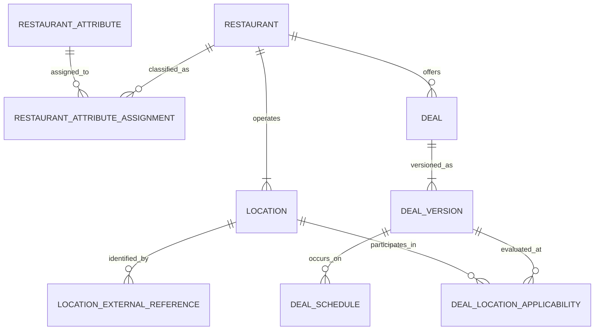

# Relational model working draft

Version 0.1 · Working design · September 30, 2026

This document translates the accepted logical model into a normalized relational reference model. It is intentionally incremental. It does not select PostgreSQL, a hosted service, or the final backend, and the SQL types remain working choices until access patterns and technology are reviewed.

## Accepted conventions

- Major business records use application-owned UUID primary keys.
- External provider identifiers never serve as application primary keys.
- Provider identifiers are stored separately so one location can be connected to multiple sources without changing its identity.
- `location.restaurant_id` is a required foreign key, implementing Restaurant 1:N Location.
- Timestamps should represent an absolute instant, equivalent to SQL `timestamp with time zone`; location time-zone names are stored separately for local deal evaluation.

## Restaurant and location foundation

### restaurant

| Column | Working type | Null? | Key / rule | Purpose |
|---|---|---:|---|---|
| restaurant_id | UUID | No | Primary key | Stable application identity for the restaurant concept. |
| name | Text | No | | Consumer-facing name. Name alone is not unique. |
| description | Text | Yes | | Optional summary. |
| price_level | Small integer | Yes | Check range TBD | Coarse price classification. |
| website_url | Text | Yes | | Official restaurant website when known. |
| image_reference | Text | Yes | | Image or asset reference; storage mechanism TBD. |
| status | Text/code | No | Allowed values TBD | Supports active and retired records without deleting history. |
| created_at | Timestamp with time zone | No | | Record creation instant. |
| updated_at | Timestamp with time zone | No | | Most recent material update instant. |

Cuisine, dining style, and food traits use the typed many-to-many structure below.

### restaurant_attribute

| Column | Working type | Null? | Key / rule | Purpose |
|---|---|---:|---|---|
| attribute_id | UUID | No | Primary key | Stable identity for one classification value. |
| attribute_type | Text/code | No | Unique with `name` | Dimension such as `CUISINE`, `DINING_STYLE`, or `FOOD_TRAIT`. |
| name | Text | No | Unique with `attribute_type` | Value such as Mexican, fast casual, or vegetarian friendly. |
| status | Text/code | No | Allowed values TBD | Allows a value to be retired without breaking history. |
| created_at | Timestamp with time zone | No | | Record creation instant. |
| updated_at | Timestamp with time zone | No | | Most recent material update instant. |

`(attribute_type, name)` must be unique after applying the database's agreed case-normalization rule.

### restaurant_attribute_assignment

| Column | Working type | Null? | Key / rule | Purpose |
|---|---|---:|---|---|
| restaurant_id | UUID | No | Composite primary key; foreign key → `restaurant.restaurant_id` | Restaurant being classified. |
| attribute_id | UUID | No | Composite primary key; foreign key → `restaurant_attribute.attribute_id` | Assigned cuisine, dining style, or food trait. |
| is_primary | Boolean | No | Default false | Marks the leading value within a dimension when useful for display. |
| created_at | Timestamp with time zone | No | | When the assignment was created. |
| updated_at | Timestamp with time zone | No | | Most recent material update instant. |

This many-to-many structure lets one restaurant carry several useful signals without adding columns for each cuisine or trait. Provider provenance and confidence may be added when ingestion rules are defined; they are not implied by the assignment itself.

### location

| Column | Working type | Null? | Key / rule | Purpose |
|---|---|---:|---|---|
| location_id | UUID | No | Primary key | Stable application identity for one physical outlet. |
| restaurant_id | UUID | No | Foreign key → `restaurant.restaurant_id` | Restaurant that operates this outlet. |
| display_name | Text | Yes | | Optional location label, such as a neighborhood. |
| address_line_1 | Text | No | | Street address. |
| address_line_2 | Text | Yes | | Suite or unit. |
| city | Text | No | | Locality. |
| region_code | Text | No | | State or region code. |
| postal_code | Text | No | | ZIP or postal code; stored as text. |
| country_code | Text | No | | Country code. |
| latitude | Decimal | Yes | Range check | Required before distance queries; precision TBD. |
| longitude | Decimal | Yes | Range check | Required before distance queries; precision TBD. |
| time_zone | Text | No | IANA name | Evaluates recurring and overnight offers in local time. |
| phone | Text | Yes | | Location-specific contact number. |
| status | Text/code | No | Allowed values TBD | Supports current, closed, moved, or retired treatment. |
| created_at | Timestamp with time zone | No | | Record creation instant. |
| updated_at | Timestamp with time zone | No | | Most recent material update instant. |

Deleting a restaurant with dependent locations should not be a normal operation. The exact foreign-key delete action will be selected with retention and correction rules; a restrictive action is the current direction.

### location_external_reference

| Column | Working type | Null? | Key / rule | Purpose |
|---|---|---:|---|---|
| location_external_reference_id | UUID | No | Primary key | Application identity for this source mapping. |
| location_id | UUID | No | Foreign key → `location.location_id` | Internal location being identified. |
| provider | Text/code | No | | Source system, such as a restaurant provider. |
| provider_location_id | Text | No | | Identifier assigned by that provider. |
| source_url | Text | Yes | | Direct source reference when applicable. |
| first_seen_at | Timestamp with time zone | No | | When the mapping was first recorded. |
| last_checked_at | Timestamp with time zone | Yes | | Most recent confirmation of the mapping. |

`(provider, provider_location_id)` must be unique. The mapping can be corrected or retired without replacing the internal `location_id` used by deals and history.

## Deal identity and immutable versions

### deal

| Column | Working type | Null? | Key / rule | Purpose |
|---|---|---:|---|---|
| deal_id | UUID | No | Primary key | Stable identity for the continuing offer concept. |
| restaurant_id | UUID | No | Foreign key → `restaurant.restaurant_id` | Restaurant offering the deal. |
| status | Text/code | No | Allowed values TBD | Lifecycle state such as active or retired. |
| created_at | Timestamp with time zone | No | | Record creation instant. |
| retired_at | Timestamp with time zone | Yes | | When the continuing offer was retired. |

The parent record provides continuity across changes. Consumer-facing terms do not live here because those terms must remain historically reproducible.

### deal_version

| Column | Working type | Null? | Key / rule | Purpose |
|---|---|---:|---|---|
| deal_version_id | UUID | No | Primary key | Identity for the exact terms shown to users. |
| deal_id | UUID | No | Foreign key → `deal.deal_id` | Continuing deal being versioned. |
| version_number | Integer | No | Unique with `deal_id`; positive | Human-readable ordering within one deal. |
| title | Text | No | | Consumer-facing offer title. |
| description | Text | Yes | | Additional concise terms. |
| deal_type | Text/code | No | Allowed values TBD | Classification used by display and scoring. |
| value_estimate | Decimal | Yes | Nonnegative; meaning TBD | Optional structured value for later scoring. |
| valid_from | Date | Yes | | First eligible local calendar date. |
| valid_through | Date | Yes | Check ≥ `valid_from` | Final eligible local calendar date. |
| scope | Text/code | No | Allowed values TBD | Claimed applicability breadth. |
| publication_status | Text/code | No | Draft/published/superseded/withdrawn direction | Controls whether this version can be presented. |
| created_at | Timestamp with time zone | No | | Draft creation instant. |
| published_at | Timestamp with time zone | Yes | Required when published | First publication instant. |
| superseded_at | Timestamp with time zone | Yes | | When a newer version replaced it. |

`(deal_id, version_number)` must be unique. A draft can be edited before publication. After publication, its consumer-facing terms are immutable: any correction or change creates another `deal_version`. A recommendation, intent, and verification event references the exact `deal_version_id` shown to the user. Withdrawal or supersession changes lifecycle metadata without rewriting the published terms.

Recurring schedules, structured eligibility, enrollment guidance, and per-location applicability will be modeled in related tables rather than packed into the version row.

### deal_schedule

| Column | Working type | Null? | Key / rule | Purpose |
|---|---|---:|---|---|
| deal_schedule_id | UUID | No | Primary key | Identity for one recurring weekday/time window. |
| deal_version_id | UUID | No | Foreign key → `deal_version.deal_version_id` | Exact published terms that own this schedule. |
| day_of_week | Small integer | No | ISO 1–7 | Local weekday, Monday through Sunday. |
| start_local_time | Time | Conditional | Required unless `all_day` | Beginning of the local offer window. |
| end_local_time | Time | Conditional | Required unless `all_day` | End of the local offer window. |
| spans_midnight | Boolean | No | Default false | Makes an overnight window explicit. |
| all_day | Boolean | No | Default false | Indicates no narrower time window that day. |

A version receives one row per valid weekday and may receive multiple rows for separate windows on the same day. This favors direct SQL readability and constraints over compressed bitmasks or JSON. A uniqueness rule should prevent duplicate windows for the same version and weekday. Schedule rows belonging to a published version are immutable with that version; changed days or times require a new `deal_version`.

### deal_location_applicability

| Column | Working type | Null? | Key / rule | Purpose |
|---|---|---:|---|---|
| deal_location_applicability_id | UUID | No | Primary key | Identity for one effective-dated applicability assertion. |
| deal_version_id | UUID | No | Foreign key → `deal_version.deal_version_id` | Exact offer terms being evaluated. |
| location_id | UUID | No | Foreign key → `location.location_id` | Physical outlet whose participation is described. |
| applicability | Text/code | No | `INCLUDED`, `EXCLUDED`, or `UNKNOWN` | Current assertion for this version and location. |
| confidence_level | Text/code | Yes | Formula/levels TBD | Derived strength of the supporting evidence. |
| effective_from | Timestamp with time zone | No | | When this assertion became current. |
| effective_through | Timestamp with time zone | Yes | Check > `effective_from` | When it stopped being current; null means current. |
| last_verified_at | Timestamp with time zone | Yes | | Most recent supporting verification time. |
| recorded_at | Timestamp with time zone | No | | When this assertion was stored. |

Applicability knowledge changes independently from published offer terms. When a location moves from `UNKNOWN` to `INCLUDED`, close the current row by setting `effective_through` and insert a new row; do not create a new `deal_version` unless the consumer-facing offer terms also changed. There must be at most one current row for a given `(deal_version_id, location_id)`. Historical applicability rows are retained, and later evidence tables will explain why each assertion changed.

Recommendation history must identify the exact deal version and location shown and retain or reference the applicability/confidence context used at that time. The confidence calculation remains open and must not be inferred from this summary column alone.

## Relationship sketch

## Next review

Add structured eligibility and enrollment guidance, then evidence and behavioral events.
