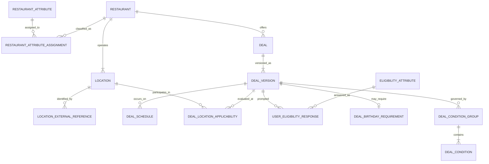

# Relational model working draft

Version 0.1 · Working design · September 30, 2026

This document translates the accepted logical model into a normalized relational reference model. It is intentionally incremental. It does not select PostgreSQL, a hosted service, or the final backend, and the SQL types remain working choices until access patterns and technology are reviewed.

## Accepted conventions

- Major business records use application-owned UUID primary keys.
- External provider identifiers never serve as application primary keys.
- Provider identifiers are stored separately so one location can be connected to multiple sources without changing its identity.
- `location.restaurant_id` is a required foreign key, implementing Restaurant 1:N Location.
- Timestamps should represent an absolute instant, equivalent to SQL `timestamp with time zone`; location time-zone names are stored separately for local deal evaluation.

## Restaurant and location foundation

### restaurant

| Column | Working type | Null? | Key / rule | Purpose |
|---|---|---:|---|---|
| restaurant_id | UUID | No | Primary key | Stable application identity for the restaurant concept. |
| name | Text | No | | Consumer-facing name. Name alone is not unique. |
| description | Text | Yes | | Optional summary. |
| price_level | Small integer | Yes | Check range TBD | Coarse price classification. |
| website_url | Text | Yes | | Official restaurant website when known. |
| image_reference | Text | Yes | | Image or asset reference; storage mechanism TBD. |
| status | Text/code | No | Allowed values TBD | Supports active and retired records without deleting history. |
| created_at | Timestamp with time zone | No | | Record creation instant. |
| updated_at | Timestamp with time zone | No | | Most recent material update instant. |

Cuisine, dining style, and food traits use the typed many-to-many structure below.

### restaurant_attribute

| Column | Working type | Null? | Key / rule | Purpose |
|---|---|---:|---|---|
| attribute_id | UUID | No | Primary key | Stable identity for one classification value. |
| attribute_type | Text/code | No | Unique with `name` | Dimension such as `CUISINE`, `DINING_STYLE`, or `FOOD_TRAIT`. |
| name | Text | No | Unique with `attribute_type` | Value such as Mexican, fast casual, or vegetarian friendly. |
| status | Text/code | No | Allowed values TBD | Allows a value to be retired without breaking history. |
| created_at | Timestamp with time zone | No | | Record creation instant. |
| updated_at | Timestamp with time zone | No | | Most recent material update instant. |

`(attribute_type, name)` must be unique after applying the database's agreed case-normalization rule.

### restaurant_attribute_assignment

| Column | Working type | Null? | Key / rule | Purpose |
|---|---|---:|---|---|
| restaurant_id | UUID | No | Composite primary key; foreign key → `restaurant.restaurant_id` | Restaurant being classified. |
| attribute_id | UUID | No | Composite primary key; foreign key → `restaurant_attribute.attribute_id` | Assigned cuisine, dining style, or food trait. |
| is_primary | Boolean | No | Default false | Marks the leading value within a dimension when useful for display. |
| created_at | Timestamp with time zone | No | | When the assignment was created. |
| updated_at | Timestamp with time zone | No | | Most recent material update instant. |

This many-to-many structure lets one restaurant carry several useful signals without adding columns for each cuisine or trait. Provider provenance and confidence may be added when ingestion rules are defined; they are not implied by the assignment itself.

### location

| Column | Working type | Null? | Key / rule | Purpose |
|---|---|---:|---|---|
| location_id | UUID | No | Primary key | Stable application identity for one physical outlet. |
| restaurant_id | UUID | No | Foreign key → `restaurant.restaurant_id` | Restaurant that operates this outlet. |
| display_name | Text | Yes | | Optional location label, such as a neighborhood. |
| address_line_1 | Text | No | | Street address. |
| address_line_2 | Text | Yes | | Suite or unit. |
| city | Text | No | | Locality. |
| region_code | Text | No | | State or region code. |
| postal_code | Text | No | | ZIP or postal code; stored as text. |
| country_code | Text | No | | Country code. |
| latitude | Decimal | Yes | Range check | Required before distance queries; precision TBD. |
| longitude | Decimal | Yes | Range check | Required before distance queries; precision TBD. |
| time_zone | Text | No | IANA name | Evaluates recurring and overnight offers in local time. |
| phone | Text | Yes | | Location-specific contact number. |
| status | Text/code | No | Allowed values TBD | Supports current, closed, moved, or retired treatment. |
| created_at | Timestamp with time zone | No | | Record creation instant. |
| updated_at | Timestamp with time zone | No | | Most recent material update instant. |

Deleting a restaurant with dependent locations should not be a normal operation. The exact foreign-key delete action will be selected with retention and correction rules; a restrictive action is the current direction.

### location_external_reference

| Column | Working type | Null? | Key / rule | Purpose |
|---|---|---:|---|---|
| location_external_reference_id | UUID | No | Primary key | Application identity for this source mapping. |
| location_id | UUID | No | Foreign key → `location.location_id` | Internal location being identified. |
| provider | Text/code | No | | Source system, such as a restaurant provider. |
| provider_location_id | Text | No | | Identifier assigned by that provider. |
| source_url | Text | Yes | | Direct source reference when applicable. |
| first_seen_at | Timestamp with time zone | No | | When the mapping was first recorded. |
| last_checked_at | Timestamp with time zone | Yes | | Most recent confirmation of the mapping. |

`(provider, provider_location_id)` must be unique. The mapping can be corrected or retired without replacing the internal `location_id` used by deals and history.

## Deal identity and immutable versions

### deal

| Column | Working type | Null? | Key / rule | Purpose |
|---|---|---:|---|---|
| deal_id | UUID | No | Primary key | Stable identity for the continuing offer concept. |
| restaurant_id | UUID | No | Foreign key → `restaurant.restaurant_id` | Restaurant offering the deal. |
| status | Text/code | No | Allowed values TBD | Lifecycle state such as active or retired. |
| created_at | Timestamp with time zone | No | | Record creation instant. |
| retired_at | Timestamp with time zone | Yes | | When the continuing offer was retired. |

The parent record provides continuity across changes. Consumer-facing terms do not live here because those terms must remain historically reproducible.

### deal_version

| Column | Working type | Null? | Key / rule | Purpose |
|---|---|---:|---|---|
| deal_version_id | UUID | No | Primary key | Identity for the exact terms shown to users. |
| deal_id | UUID | No | Foreign key → `deal.deal_id` | Continuing deal being versioned. |
| version_number | Integer | No | Unique with `deal_id`; positive | Human-readable ordering within one deal. |
| title | Text | No | | Consumer-facing offer title. |
| description | Text | Yes | | Additional concise terms. |
| deal_type | Text/code | No | Allowed values TBD | Classification used by display and scoring. |
| value_estimate | Decimal | Yes | Nonnegative; meaning TBD | Optional structured value for later scoring. |
| valid_from | Date | Yes | | First eligible local calendar date. |
| valid_through | Date | Yes | Check ≥ `valid_from` | Final eligible local calendar date. |
| scope | Text/code | No | Allowed values TBD | Claimed applicability breadth. |
| terms_text | Text | Yes | | Full consumer-readable terms retained alongside structured conditions. |
| disclaimer_text | Text | Yes | | Additional wording such as restrictions or proof requirements. |
| official_terms_url | Text | Yes | | Official destination for complete current terms when available. |
| publication_status | Text/code | No | Draft/published/superseded/withdrawn direction | Controls whether this version can be presented. |
| created_at | Timestamp with time zone | No | | Draft creation instant. |
| published_at | Timestamp with time zone | Yes | Required when published | First publication instant. |
| superseded_at | Timestamp with time zone | Yes | | When a newer version replaced it. |

`(deal_id, version_number)` must be unique. A draft can be edited before publication. After publication, its consumer-facing terms are immutable: any correction or change creates another `deal_version`. A recommendation, intent, and verification event references the exact `deal_version_id` shown to the user. Withdrawal or supersession changes lifecycle metadata without rewriting the published terms.

Recurring schedules, structured eligibility, enrollment guidance, and per-location applicability will be modeled in related tables rather than packed into the version row.

### deal_schedule

| Column | Working type | Null? | Key / rule | Purpose |
|---|---|---:|---|---|
| deal_schedule_id | UUID | No | Primary key | Identity for one recurring weekday/time window. |
| deal_version_id | UUID | No | Foreign key → `deal_version.deal_version_id` | Exact published terms that own this schedule. |
| day_of_week | Small integer | No | ISO 1–7 | Local weekday, Monday through Sunday. |
| start_local_time | Time | Conditional | Required unless `all_day` | Beginning of the local offer window. |
| end_local_time | Time | Conditional | Required unless `all_day` | End of the local offer window. |
| spans_midnight | Boolean | No | Default false | Makes an overnight window explicit. |
| all_day | Boolean | No | Default false | Indicates no narrower time window that day. |

A version receives one row per valid weekday and may receive multiple rows for separate windows on the same day. This favors direct SQL readability and constraints over compressed bitmasks or JSON. A uniqueness rule should prevent duplicate windows for the same version and weekday. Schedule rows belonging to a published version are immutable with that version; changed days or times require a new `deal_version`.

### deal_location_applicability

| Column | Working type | Null? | Key / rule | Purpose |
|---|---|---:|---|---|
| deal_location_applicability_id | UUID | No | Primary key | Identity for one effective-dated applicability assertion. |
| deal_version_id | UUID | No | Foreign key → `deal_version.deal_version_id` | Exact offer terms being evaluated. |
| location_id | UUID | No | Foreign key → `location.location_id` | Physical outlet whose participation is described. |
| applicability | Text/code | No | `INCLUDED`, `EXCLUDED`, or `UNKNOWN` | Current assertion for this version and location. |
| confidence_level | Text/code | Yes | Formula/levels TBD | Derived strength of the supporting evidence. |
| effective_from | Timestamp with time zone | No | | When this assertion became current. |
| effective_through | Timestamp with time zone | Yes | Check > `effective_from` | When it stopped being current; null means current. |
| last_verified_at | Timestamp with time zone | Yes | | Most recent supporting verification time. |
| recorded_at | Timestamp with time zone | No | | When this assertion was stored. |

Applicability knowledge changes independently from published offer terms. When a location moves from `UNKNOWN` to `INCLUDED`, close the current row by setting `effective_through` and insert a new row; do not create a new `deal_version` unless the consumer-facing offer terms also changed. There must be at most one current row for a given `(deal_version_id, location_id)`. Historical applicability rows are retained, and later evidence tables will explain why each assertion changed.

Recommendation history must identify the exact deal version and location shown and retain or reference the applicability/confidence context used at that time. The confidence calculation remains open and must not be inferred from this summary column alone.

## Deal-condition framework

Review of current official restaurant terms shows that “eligibility” is too broad for one field or table. The relational design must keep these condition families distinct:

| Condition family | Question answered | Examples |
|---|---|---|
| Audience requirement | Who qualifies? | Child/senior age, veteran, first responder, healthcare worker, student, educator, loyalty member or tier, birthday, new customer. |
| Purchase requirement | What must be bought? | Minimum spend, adult entrée, qualifying item, number of paid items. |
| Redemption method | How or where is it redeemed? | Dine-in, restaurant app, website, counter, drive-through, pickup, restaurant delivery. |
| Usage limit | How often or how many? | Per person, account, table, visit, day or week; maximum free items or dollar value. |
| Exclusion/combination rule | What cannot be combined or counted? | Other coupons, rewards, alcohol, taxes, fees, gift cards, value menu or third-party delivery. |

Location participation and recurring time validity remain in their dedicated structures. Verification actions such as showing ID, scanning a code, claiming in an app or presenting a membership card must also remain distinguishable from the underlying audience requirement.

Official examples reviewed include [McDonald's deal and rewards terms](https://www.mcdonalds.com/us/en-us/terms-and-conditions.html), [Denny's deal FAQ](https://dennys.com/faqs-frequently-asked-questions), [Chick-fil-A offer rules](https://www.chick-fil-a.com/officialrules), and [Outback's Heroes Discount](https://www.outback.com/offers/military-mates). These examples establish the condition families; they are not permanent claims about every location or future offer.

The working direction is a shared base condition record plus typed detail tables. Shared fields can preserve the deal version, condition family, consumer wording, source wording and display order. Typed tables will hold enforceable values such as age ranges, purchase amounts, membership programs, channels and usage counts. Exact tables follow after the user-data counterpart is reviewed.

### deal_condition_group

| Column | Working type | Null? | Key / rule | Purpose |
|---|---|---:|---|---|
| deal_condition_group_id | UUID | No | Primary key | Identity for one group of related requirements. |
| deal_version_id | UUID | No | Foreign key → `deal_version.deal_version_id` | Published terms that own the group. |
| match_rule | Text/code | No | `ANY` or `ALL` | Whether any or every condition in this group must match. |
| display_name | Text | Yes | | Optional operations-facing label for the group. |
| display_order | Integer | No | Nonnegative | Stable order for presenting grouped terms. |

All condition groups attached to a deal version must pass. Within each group, `ANY` represents OR and `ALL` represents AND. This supports common expressions such as `(veteran OR active military OR first responder) AND dine-in AND qualifying purchase` without a general nested rules language.

### deal_condition

| Column | Working type | Null? | Key / rule | Purpose |
|---|---|---:|---|---|
| deal_condition_id | UUID | No | Primary key | Identity shared by one typed condition detail. |
| deal_condition_group_id | UUID | No | Foreign key → `deal_condition_group.deal_condition_group_id` | Boolean group containing this condition. |
| condition_family | Text/code | No | Accepted condition family | Audience, purchase, redemption method, usage limit, or exclusion. |
| condition_type | Text/code | No | Typed-detail discriminator | Selects the structured detail table and engine evaluator. |
| consumer_text | Text | No | | Concise condition wording shown to the user. |
| source_text | Text | Yes | | Exact or fuller source wording retained for review. |
| display_order | Integer | No | Nonnegative | Stable order within the group. |

Each `deal_condition` must have exactly one matching typed detail record. The detail tables remain the source of machine-evaluable values; `consumer_text` and `source_text` do not replace them. Groups, conditions and typed details become immutable with their published deal version.

### Personalization and contextual collection

The engine needs comparable user or household characteristics for audience conditions. When a relevant local offer requires an unknown characteristic, the app may ask a short contextual question such as: **“XYZ Diner offers a veteran discount. Does this apply to you or someone in your household?”** The answer is stored as a self-reported eligibility characteristic and can be edited or removed later.

Do not ask every possible eligibility question during onboarding. Collect a characteristic when it unlocks or filters a real nearby opportunity. Store `ELIGIBLE`, `NOT_ELIGIBLE`, and `UNKNOWN` distinctly; a skipped question remains unknown. Preserve whether the answer applies to the user or household, its self-reported source, answer time, optional expiration/recheck time and last update. Do not treat self-reporting as documentary verification.

For ranking, a known match may use the deal benefit; a known mismatch filters that deal; an unknown response does not assume eligibility. The restaurant can still be considered independently from the inapplicable or unresolved offer.

### eligibility_attribute

| Column | Working type | Null? | Key / rule | Purpose |
|---|---|---:|---|---|
| eligibility_attribute_id | UUID | No | Primary key | Stable identity for a self-reportable audience characteristic. |
| code | Text/code | No | Unique | Machine-readable value such as `VETERAN` or `FIRST_RESPONDER`. |
| display_name | Text | No | | Consumer-readable name. |
| prompt_text | Text | No | | Reusable contextual question shown when a relevant deal finds no answer. |
| status | Text/code | No | Allowed values TBD | Allows a characteristic to be retired without deleting responses. |
| created_at | Timestamp with time zone | No | | Record creation instant. |
| updated_at | Timestamp with time zone | No | | Most recent material update instant. |

This lookup covers characteristics that require a direct user answer. Facts already stored structurally, such as saved child ages, should be derived from their authoritative profile data rather than copied here.

### user_eligibility_response

| Column | Working type | Null? | Key / rule | Purpose |
|---|---|---:|---|---|
| user_eligibility_response_id | UUID | No | Primary key | Identity for the current self-reported response. |
| user_id | UUID | No | Foreign key → future `app_user.user_id` | User who answered and, for `SELF`, the qualifying person. |
| household_id | UUID | No | Foreign key → future `household.household_id` | Household context used by recommendations. |
| eligibility_attribute_id | UUID | No | Foreign key → `eligibility_attribute.eligibility_attribute_id` | Characteristic being answered. |
| response | Text/code | No | `SELF`, `HOUSEHOLD_MEMBER`, `NOT_ELIGIBLE`, or `UNKNOWN` | Distinguishes who may qualify without identifying another household member. |
| prompted_by_deal_version_id | UUID | Yes | Foreign key → `deal_version.deal_version_id` | Relevant offer that caused the contextual question. |
| answered_at | Timestamp with time zone | Yes | Null when explicitly left unknown | When the user supplied the current answer. |
| recheck_after | Timestamp with time zone | Yes | | Optional future prompt date for characteristics that can change. |
| created_at | Timestamp with time zone | No | | Record creation instant. |
| updated_at | Timestamp with time zone | No | | Most recent edit instant. |

Only one current response should exist for `(user_id, household_id, eligibility_attribute_id)`. The answer is user-confirmed matching data, not verified eligibility. Do not store identification documents or imply that the restaurant will accept the claim. `HOUSEHOLD_MEMBER` records no name; it means someone in the dining household may qualify and may need to be present for redemption. Users can edit the response later, and **Skip** is stored as `UNKNOWN` or left unknown according to the eventual event contract.

The engine does not need a prompt policy copied onto every deal. When a structured deal requirement references an `eligibility_attribute` and no current response exists, the missing join is the unknown state and the attribute supplies the reusable question. Adding another characteristic creates lookup and response rows rather than a new `app_user` column.

### user_occasion

| Column | Working type | Null? | Key / rule | Purpose |
|---|---|---:|---|---|
| user_occasion_id | UUID | No | Primary key | Identity for a date-based user occasion. |
| user_id | UUID | No | Foreign key → future `app_user.user_id` | User whose occasion is stored. |
| occasion_type | Text/code | No | Initial value `BIRTHDAY` | Kind of recurring occasion. |
| month | Small integer | No | 1–12 | Calendar month without requiring a birth year. |
| day | Small integer | No | Valid for month | Calendar day without requiring a birth year. |
| created_at | Timestamp with time zone | No | | Record creation instant. |
| updated_at | Timestamp with time zone | No | | Most recent edit instant. |

`(user_id, occasion_type)` is unique for the initial model. Birth year is not collected merely to support birthday offers. If later age-based adult eligibility requires a complete date of birth, that need receives a separate privacy and schema review.

### deal_birthday_requirement

| Column | Working type | Null? | Key / rule | Purpose |
|---|---|---:|---|---|
| deal_version_id | UUID | No | Primary key; foreign key → `deal_version.deal_version_id` | Version offering the birthday benefit. |
| days_before | Small integer | No | Nonnegative | Eligible days before the birthday. |
| days_after | Small integer | No | Nonnegative | Eligible days after the birthday. |
| terms_text | Text | Yes | | Birthday-specific details not otherwise structured. |

The engine compares the user's recurring month/day with the version's validity and birthday window. If no birthday exists and a relevant offer is available, the app may invite the user to add it. Restaurant membership, purchase, channel and redemption requirements remain independent conditions even when they also apply to the birthday deal.

## Relationship sketch

## Next review

Define the typed condition detail tables, then add the core user/household tables, evidence and behavioral events.
