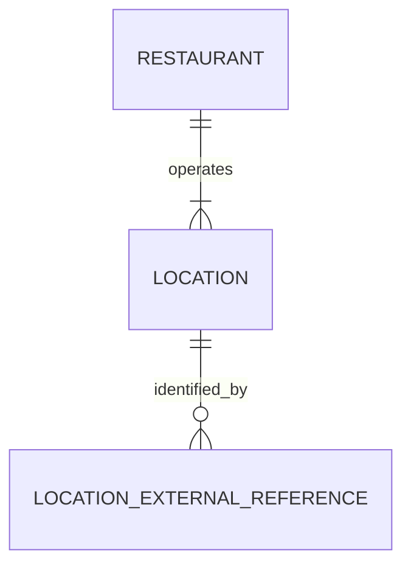

# Relational model working draft

Version 0.1 · Working design · September 30, 2026

This document translates the accepted logical model into a normalized relational reference model. It is intentionally incremental. It does not select PostgreSQL, a hosted service, or the final backend, and the SQL types remain working choices until access patterns and technology are reviewed.

## Accepted conventions

- Major business records use application-owned UUID primary keys.
- External provider identifiers never serve as application primary keys.
- Provider identifiers are stored separately so one location can be connected to multiple sources without changing its identity.
- `location.restaurant_id` is a required foreign key, implementing Restaurant 1:N Location.
- Timestamps should represent an absolute instant, equivalent to SQL `timestamp with time zone`; location time-zone names are stored separately for local deal evaluation.

## Restaurant and location foundation

### restaurant

| Column | Working type | Null? | Key / rule | Purpose |
|---|---|---:|---|---|
| restaurant_id | UUID | No | Primary key | Stable application identity for the restaurant concept. |
| name | Text | No | | Consumer-facing name. Name alone is not unique. |
| description | Text | Yes | | Optional summary. |
| price_level | Small integer | Yes | Check range TBD | Coarse price classification. |
| website_url | Text | Yes | | Official restaurant website when known. |
| image_reference | Text | Yes | | Image or asset reference; storage mechanism TBD. |
| status | Text/code | No | Allowed values TBD | Supports active and retired records without deleting history. |
| created_at | Timestamp with time zone | No | | Record creation instant. |
| updated_at | Timestamp with time zone | No | | Most recent material update instant. |

Cuisine and category need a separate review before deciding whether they belong in one lookup table, several many-to-many tables, or a simpler MVP representation.

### location

| Column | Working type | Null? | Key / rule | Purpose |
|---|---|---:|---|---|
| location_id | UUID | No | Primary key | Stable application identity for one physical outlet. |
| restaurant_id | UUID | No | Foreign key → `restaurant.restaurant_id` | Restaurant that operates this outlet. |
| display_name | Text | Yes | | Optional location label, such as a neighborhood. |
| address_line_1 | Text | No | | Street address. |
| address_line_2 | Text | Yes | | Suite or unit. |
| city | Text | No | | Locality. |
| region_code | Text | No | | State or region code. |
| postal_code | Text | No | | ZIP or postal code; stored as text. |
| country_code | Text | No | | Country code. |
| latitude | Decimal | Yes | Range check | Required before distance queries; precision TBD. |
| longitude | Decimal | Yes | Range check | Required before distance queries; precision TBD. |
| time_zone | Text | No | IANA name | Evaluates recurring and overnight offers in local time. |
| phone | Text | Yes | | Location-specific contact number. |
| status | Text/code | No | Allowed values TBD | Supports current, closed, moved, or retired treatment. |
| created_at | Timestamp with time zone | No | | Record creation instant. |
| updated_at | Timestamp with time zone | No | | Most recent material update instant. |

Deleting a restaurant with dependent locations should not be a normal operation. The exact foreign-key delete action will be selected with retention and correction rules; a restrictive action is the current direction.

### location_external_reference

| Column | Working type | Null? | Key / rule | Purpose |
|---|---|---:|---|---|
| location_external_reference_id | UUID | No | Primary key | Application identity for this source mapping. |
| location_id | UUID | No | Foreign key → `location.location_id` | Internal location being identified. |
| provider | Text/code | No | | Source system, such as a restaurant provider. |
| provider_location_id | Text | No | | Identifier assigned by that provider. |
| source_url | Text | Yes | | Direct source reference when applicable. |
| first_seen_at | Timestamp with time zone | No | | When the mapping was first recorded. |
| last_checked_at | Timestamp with time zone | Yes | | Most recent confirmation of the mapping. |

`(provider, provider_location_id)` must be unique. The mapping can be corrected or retired without replacing the internal `location_id` used by deals and history.

## Relationship sketch

## Next review

Define cuisine/category structure, then add Deal and DealLocation using the already accepted applicability, timing, eligibility, and evidence rules.
